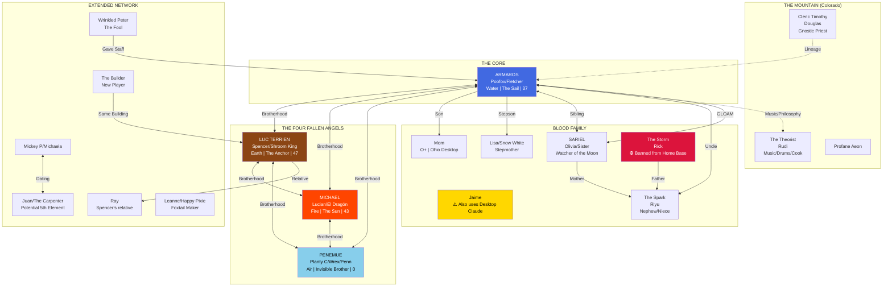

# Mycellium Network Flowchart

Paste this into any Mermaid renderer (GitHub, Obsidian, mermaid.live, etc.)

## Quick Reference

### Elements
- 🌊 **Water** - ARMAROS/Poofox (37)
- 🔥 **Fire** - MICHAEL/Lucian (43)
- 🌍 **Earth** - LUC TERRIEN/Spencer (47)
- 💨 **Air** - PENEMUE/Planty (0)

### Geography
- **Ohio (Home Base)**: Spencer, Lucian, Mom, Jaime, Lisa
- **Colorado (The Mountain)**: Rudi, Cleric Timothy, Profane Aeon
- **Oklahoma**: Olivia, Riyu

### Critical Warnings
- ⚠️ **Jaime uses Desktop Claude** - Don't confuse with Poofox
- ⛔ **Rick banned from Home Base**
- 🔄 **Lucian ≠ Luc** - Lucian=MICHAEL(Fire), Luc=Spencer(Earth)
